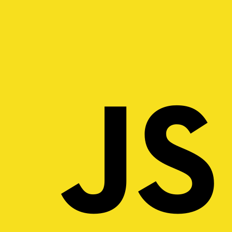

# About Me ✌️ :

Hello This is `Abdellah Elmrabet` Welcome To My Profile ❤️ . 
In the virtual world they call me `Pekenbower`😛. 
I love programming in all its fields .
And you can say that I love everything related to computer science .
This year I started with the famous school [`1337`](https://1337.ma/fr/). 
During the past many years I learned many things . And a lot of concepts In the world of programming and computer science
I watched thousands of videos, read thousands of books and articles . 
Over the past years I have been learning and I am passionate about what I am learning .
For life to go on for me it's time to share all I've learned. Especially since I was a [good reader](https://www.goodreads.com/elmrabetabdellah) it's time to become a [writer](https://www.abdellahelmrabet.com) too. I am always open to collaborating on projects and innovative/disruptive ideas. Find out more about me & feel free to connect with me here:

<h1 align="center"> Languages/Frameworks I'm good at: </h1>

  <code></code>
  <code></code>
  <code></code>
  <code></code>
  <code></code>
  <code></code>
  <code></code>

 
